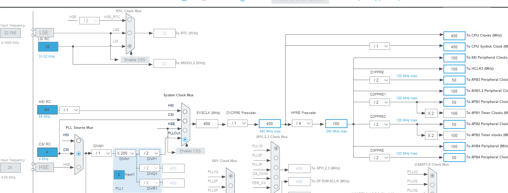
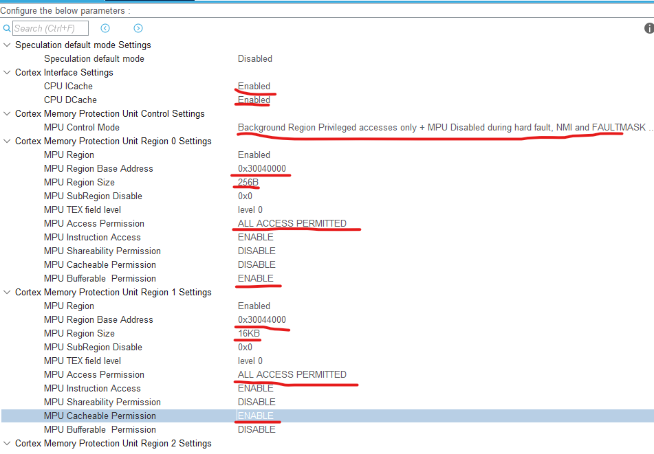
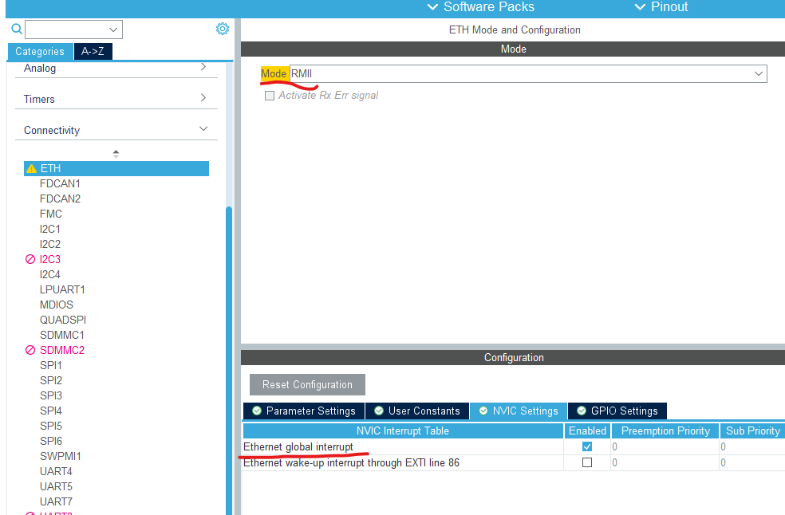
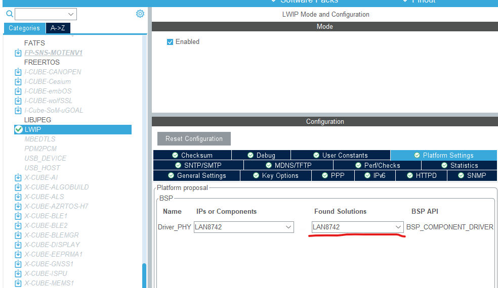
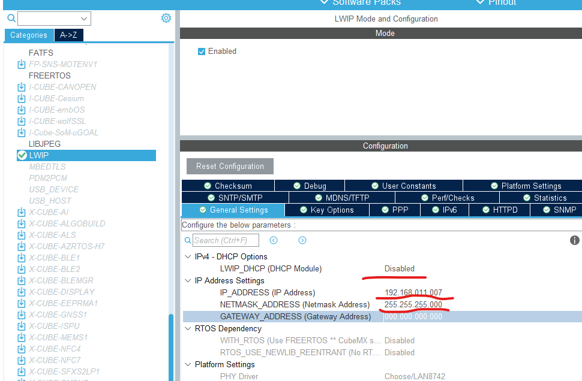
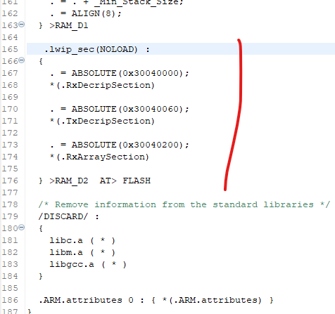
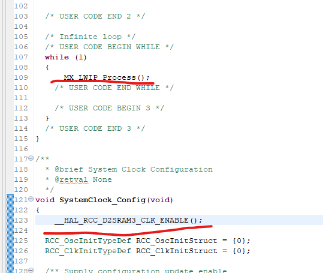

# STM32H7_ETH

本项目实现STM32H7的网络实现
内容参考：
https://blog.csdn.net/weixin_43473988/article/details/120743195?spm=1001.2014.3001.5502


#硬件
NUCLEO-H743ZI2

#开发环境
STM32CubeIDE
Version: 1.13.0
Build: 17399_20230707_0829 (UTC)

#配置说明
##时钟
保证CPU在400MHz


##SYS
1.打开DCache和ICache
2.配置MPC


##ETH配置
1.选择RMII*会自动生成管脚配置，不要碰
2.打开全局中断


##LWIP配置
选择PHY型号


根据需要配置静态IP地址


##配置SRAM地址
在STM32H743ZITX_FLASH.ld中添加以下配置
```
   .lwip_sec(NOLOAD) :
  {
    . = ABSOLUTE(0x30040000);
    *(.RxDecripSection)
    
    . = ABSOLUTE(0x30040060);
    *(.TxDecripSection)
    
    . = ABSOLUTE(0x30040200);
    *(.RxArraySection)
    
  } >RAM_D2  AT> FLASH
```


##修改main.c
添加以下两行


